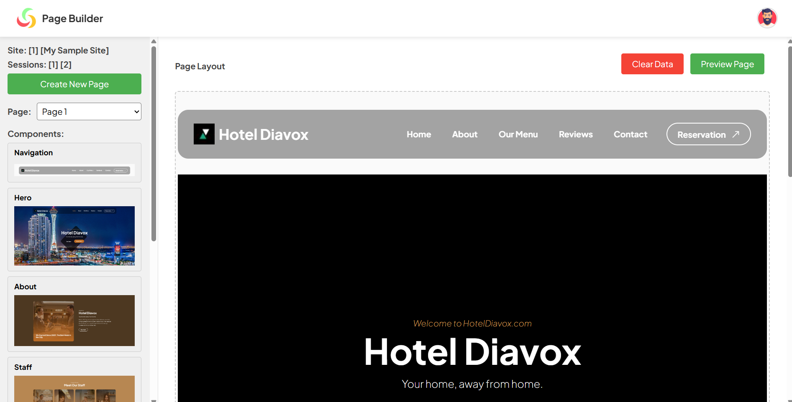

# Laravel Page Builder

A lightweight and developer-friendly CMS module built with Laravel and jQuery, using custom CSS (no Tailwind or Bootstrap). This tool is designed to be easily integrated into existing Laravel applications that need simple content management capabilities.

## Key Features

- Built with Laravel: Leverages Laravel's powerful framework and includes migration tables for quick integration.

- Custom Page Builder: Drag-and-drop inspired CMS interface using jQuery and custom CSS—no external UI frameworks required.

- Modular Integration: Designed to plug into existing apps for adding CMS capabilities without starting from scratch.

- Site & Template Selection: Easily create pages by selecting a site and assigning a template.

- Customizable Templates: Developers can add, modify, or import their own HTML templates—fully customizable structure and style.

- Flexible Asset Management:

  - Customize styles and scripts using the includes section.

  - Centralized asset library with image upload and selection support.

- Content Editing:

  - Page form allows inline editing of text fields like titles and image sources.

  - Clean separation of content and layout for maintainability.

## Developer-Focused

- Add new templates by simply uploading or defining them in your preferred structure.

- Full control over design, logic, and asset management.

- Built for extensibility—ideal for apps that want embedded CMS capabilities without bloated overhead.

## Database Structures - Migration Information

- `templates` - Stores all available page templates. Each template defines the layout structure that can be reused for creating pages.
- `sites` - Represents different websites or instances a user can manage. Allows multi-site support, where each site belongs to a specific user.
- `pages` - Used for storing individual pages created under a site. Each page can be assigned a specific template and can be marked as the landing page.
- `blocks` - Stores modular blocks that make up the content of a page. Each block has a type and position for sorting on the page.
- `block_fields` - Stores editable fields for each block (e.g., title, image source). Each field has a key, value, and field type.
- `block_field_groups` - Groups multiple field items under a block. Useful for repeatable structured content like testimonials, pricing tables, or FAQ sections.
- `block_field_group_items` - Stores individual items within a field group. Each item includes a name, value, type, and position for ordering.
- `asset_libraries` - Stores uploaded assets (e.g., images) linked to specific templates. Used in the asset selector for reusing media across blocks.

## Screenshots

- Main Page

- Preview Page

## Developer

- [Jerome Soriano](https://github.com/dvxgit-jsoriano)

*"Feel free to read, use, and apply to your projects."*

## Credits

- Thanks to tooplate -> [Barista Cafe](https://www.tooplate.com/view/2137-barista-cafe) for an awesome template.